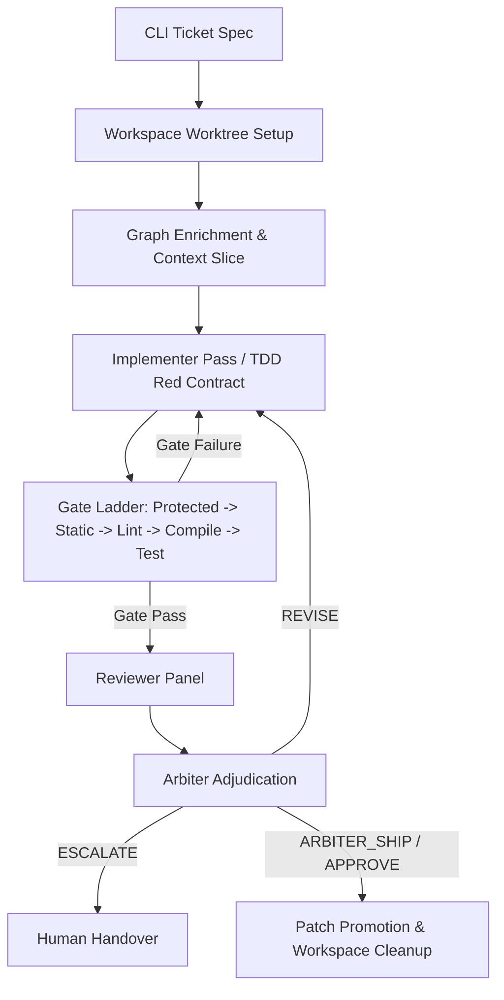
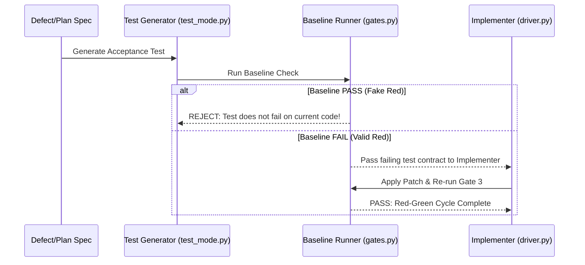

# Independent Engineering Review: Agent Loop Architecture & Control Plane

> [!IMPORTANT]
> **Executive Summary & Purpose**
> This document represents an independent, deep-codebase engineering audit of the `agent-loop` system (`src/agent_loop`). It builds upon and complements the existing review in [`AGENT_LOOP_CRITICAL_REVIEW.md`](file:///c:/Users/vinay/agent-loop/docs/architecture/AGENT_LOOP_CRITICAL_REVIEW.md).
> While `agent-loop` demonstrates exceptional maturity compared to standard autonomous coding prototypes (e.g., explicit phase pipelines, worktree isolation, gate ladders, and arbiter adjudication), this review identifies critical system-level vulnerabilities across process IPC deadlocks, context admission controls, memory indexing decay, provider transport resilience, and output parsing edge cases.

---

## System Architecture & Control Flow State Machine



### 1. Control Plane State Machine Integrity

The execution pipeline in [`src/agent_loop/loop.py`](file:///c:/Users/vinay/agent-loop/src/agent_loop/loop.py) operates a multi-stage control plane (`Implement -> Gate Ladder -> Review Panel -> Arbiter -> Apply/Promote`). 

**Key Strengths:**
* **Phase Boundaries:** Clear separation of concerns between code generation ([`driver.py`](file:///c:/Users/vinay/agent-loop/src/agent_loop/developer/driver.py)), mechanical verification ([`gates.py`](file:///c:/Users/vinay/agent-loop/src/agent_loop/gates.py)), adversarial detection ([`loop.py`](file:///c:/Users/vinay/agent-loop/src/agent_loop/loop.py)), and adjudication ([`arbiter.py`](file:///c:/Users/vinay/agent-loop/src/agent_loop/arbiter.py)).
* **Promotable Verdict Standardization:** Standardized `PROMOTABLE` tuple (`APPROVE`, `APPROVE_PARTIAL`, `ARBITER_SHIP`) prevents CLI exit-code mismatches.

**Critical Architectural Gaps:**
* **Non-Transactional Phase Transitions:** If an unhandled exception or provider timeout occurs mid-round (e.g. during arbiter evaluation), the worktree remains dirty and uncommitted. Subsequent ticket runs or retries reuse the existing dirty workspace without atomic rollback or explicit state checkpointing.
* **Asymmetric Mode Execution:** Developer mode ([`driver.py`](file:///c:/Users/vinay/agent-loop/src/agent_loop/developer/driver.py)) bypasses the review panel and relies solely on gates, whereas standard loop mode requires full reviewer consensus or arbiter override. The transition mechanics between modes lack unified telemetry.

---

### 2. Disposable Git Worktree Lifecycle

File system isolation is implemented in [`src/agent_loop/workspace.py`](file:///c:/Users/vinay/agent-loop/src/agent_loop/workspace.py).

```python
# From src/agent_loop/workspace.py lines 62-94
@contextmanager
def run_lock(path: Path, holder: str = "", wait_secs: int = 0) -> Iterator[None]:
    # Custom PID-based run lock mechanism
```

**Key Strengths:**
* **Isolation Guarantee:** Edits are strictly isolated within temporary git worktrees (`.git/worktrees/agent-loop-*`), eliminating side-effect corruption on the active working directory.
* **Process-Aware Advisory Lock:** `run_lock()` inspects active PIDs using OS-native checks (`tasklist` on Windows, `os.kill(pid, 0)` on Unix) to automatically reclaim stale lock files left by crashed processes.

**Identified Issues:**
* **Untracked File Leaks during Diff Generation:** In [`workspace.py:136-155`](file:///c:/Users/vinay/agent-loop/src/agent_loop/workspace.py#L136-L155), `stage_new_files()` uses `git add --intent-to-add` to make newly created files visible to `git diff`. However, if a candidate patch fails static or compile gates and is reverted, newly created untracked files are not pruned by `revert()` (which only executes `git checkout -- <file>`), leaving orphaned files in the worktree.
* **Dirty Baseline Noise:** `dirty_files()` relies on `git status --porcelain`. If a repository has existing uncommitted changes prior to worktree creation, those pre-existing changes bleed into ticket diff calculations.

---

## Inter-Process Communication & MCP Deadlock Risks

### 1. Stdio MCP Process Deadlock Risk

The MCP client implementation in [`src/agent_loop/mcp_client.py`](file:///c:/Users/vinay/agent-loop/src/agent_loop/mcp_client.py) spawns external server processes using `subprocess.Popen`:

```python
# From src/agent_loop/mcp_client.py lines 65-74
self._proc = subprocess.Popen(
    [self.command] + self.args,
    stdin=subprocess.PIPE,
    stdout=subprocess.PIPE,
    stderr=subprocess.PIPE,  # <--- PIPE created but never drained!
    env=full_env,
    text=True,
    bufsize=1,
    encoding="utf-8",
)
```

> [!CAUTION]
> **Subprocess Stderr Deadlock Analysis**
> In `mcp_client.py:69`, `stderr` is set to `subprocess.PIPE`. However, the client thread only reads from `stdout` (line 145: `line = self._proc.stdout.readline()`).
> Operating system pipe buffers (typically 64KB on Windows/Linux) will fill up if an MCP server emits verbose diagnostic logs, trace warnings, or unhandled stack traces to `stderr`.
> 
> **Failure Cascade:**
> 1. MCP Server writes diagnostic logs to `stderr` until the 64KB OS buffer is full.
> 2. MCP Server process blocks on its next write to `stderr`.
> 3. `agent-loop` client blocks indefinitely on `stdout.readline()` waiting for a JSON-RPC response that will never arrive.
> 4. The 120-second deadline check in `mcp_client.py:143` is **never evaluated** because Python's blocking `readline()` call holds execution thread lock.

**Recommendation:**
Modify `mcp_client.py` to inherit `stderr` (`stderr=subprocess.DEVNULL` or `stderr=subprocess.STDOUT`), or spawn a dedicated background thread to drain `stderr` into a rolling memory buffer/log file.

---

### 2. Synchronous Graph Context Enrichment

In [`src/agent_loop/context.py`](file:///c:/Users/vinay/agent-loop/src/agent_loop/context.py), `build_context_slice()` executes synchronous, serial JSON-RPC calls over MCP to fetch symbol traces, callers, and test references:

```python
# From src/agent_loop/context.py
# Serial RPC calls per region symbol:
# 1. trace_call_path(outbound)
# 2. trace_call_path(inbound)
# 3. search_code(test_search)
```

**Impact:**
* For multi-region tickets with multiple symbols, context retrieval can execute 10–20 serial RPC roundtrips.
* Lack of aggregate ticket-level deadlines allows a slow or degraded graph server to consume 2+ minutes before the first LLM implementation prompt is compiled.

---

## Context Window, Token Accounting & Compaction Architecture

### 1. Character-to-Token Ratio Heuristics

Throughout the codebase (e.g. [`src/agent_loop/compaction.py:40`](file:///c:/Users/vinay/agent-loop/src/agent_loop/compaction.py#L40)), token counts are estimated using a fixed character ratio:
```python
_CHARS_PER_TOKEN = 4  # 1 token = 4 characters
```

> [!WARNING]
> **Token Estimation Discrepancy in Source Code**
> Code snippets, JSON structures, indented code blocks, and system instructions contain high densities of special characters, syntax delimiters, and whitespace. Modern Byte-Pair Encoding (BPE) tokenizers (such as OpenAI `cl100k_base`/`o200k_base`, Claude, or Llama) average **2.5 to 3.2 characters per token** on raw source code.
> 
> Using `_CHARS_PER_TOKEN = 4` **underestimates token usage by 20% to 35%**. A prompt calculated as 35,000 tokens by `agent-loop` may actually contain ~48,000 tokens when encoded by the LLM provider, causing unexpected context overflow errors.

---

### 2. Systemic Context Budget Overrun Vulnerability

In [`src/agent_loop/compaction.py`](file:///c:/Users/vinay/agent-loop/src/agent_loop/compaction.py), `compact_history()` enforces history pruning:

```python
# From src/agent_loop/compaction.py lines 97-104
pinned = pin_count(history) # Returns 2 (System Prompt + Implement Prompt)
protected_from = max(pinned, len(history) - 2)

compacted: List[Dict[str, str]] = list(history[:pinned])
for i in range(pinned, len(history)):
    ...
```

**Structural Flaw:**
1. `history[0]` (System Prompt) and `history[1]` (Implement Prompt containing full ticket spec and verbatim region source code) are pinned and **never compacted**.
2. If a ticket targets large source regions, `history[0]` + `history[1]` alone can exceed the profile's `round_input_token_budget` (e.g. 40,000 tokens).
3. Because Phase 4a and Phase 4b compaction only target messages between index `pinned` (2) and `protected_from`, compaction **has zero removable content**.
4. The loop proceeds to send an oversized prompt to the LLM provider, resulting in `400 Bad Request: context_length_exceeded` or expensive token truncation.

---

### 3. Local Model KV-Cache Memory Pressures

In [`src/agent_loop/config.py`](file:///c:/Users/vinay/agent-loop/src/agent_loop/config.py) and [`src/agent_loop/providers.py`](file:///c:/Users/vinay/agent-loop/src/agent_loop/providers.py), Ollama context windows are dynamically expanded via `_fit_num_ctx()`:

```python
# Automatically increases num_ctx based on prompt length + requested output
num_ctx = prompt_tokens + max_tokens + headroom
```

**Operational Risk:**
* For local Ollama inference, requesting large `num_ctx` allocations (e.g., 32,768 to 65,536 tokens) forces Ollama to allocate massive GPU VRAM / Host RAM for the KV-cache.
* Without checking host RAM/VRAM capacity or model architecture limits, parallel reviewer calls against local Ollama models can trigger GPU Out-Of-Memory (OOM) crashes, swap thrashing, or extreme latency degradation.

---

## Provider Layer, Cost Model & Reliability Design

### 1. Multi-Provider API Abstraction

The provider shim in [`src/agent_loop/providers.py`](file:///c:/Users/vinay/agent-loop/src/agent_loop/providers.py) supports `ollama`, `anthropic`, `openai`, `gemini`, `github`, and `agy` without third-party dependencies (using standard library `urllib.request`).

```python
# Thin HTTP transport using urllib.request
```

**Strengths:**
* Zero external dependencies (LiteLLM-free), keeping execution fast and virtual environment clean.
* Unified `Completion` dataclass across all backends.
* Distinguishes `ProviderError` (network/HTTP failure) from model responses.

**Weaknesses & Failure Modes:**
* **Coarse Retry Strategy:** Retries use fixed or random sleep intervals without exponential backoff or HTTP header inspection (e.g., `Retry-After`).
* **HTTP Error Handling:** Certain HTTP 429 (Rate Limit) or 529 (Overloaded) responses are treated as generic `ProviderError` exceptions after exhaustion, aborting the round rather than initiating an extended queue backoff.
* **Anthropic Sampling Guardrails:** In `providers.py:53-55`, sampling parameters (`temperature`, `top_p`) are stripped for newer Claude models (`_SAMPLING_REJECTED`). However, if Anthropic updates model naming conventions, hardcoded regexes will fail to match, causing 400 API errors.

---

### 2. Cost Model & Telemetry Limitations

In [`src/agent_loop/providers.py:85-94`](file:///c:/Users/vinay/agent-loop/src/agent_loop/providers.py#L85-L94):

```python
@property
def cost_usd(self) -> float:
    # Calculates cost using static PRICING dictionary
```

**Operational Gaps:**
1. **Subscription & Local Model Invisibility:** Models under subscription (e.g. Ollama cloud, local models) evaluate to `$0.00`, masking GPU hardware time, power consumption, and wall-clock execution cost.
2. **Missing Cost Ledger Factors:** The cost model omits:
   * Local CPU / GPU VRAM memory pressure
   * Subprocess test execution time
   * MCP server RPC overhead
   * Failed retry token burn

---

## Gates, Adjudication & TDD Integrity

### 1. Mechanical Gate Ladder

Gate verification logic is located in [`src/agent_loop/gates.py`](file:///c:/Users/vinay/agent-loop/src/agent_loop/gates.py).

```
Gate Pipeline:
Protected Paths (Gate 0) 
  └─> Static Validation (Gate 1) 
       └─> Lint Check (Gate 1.5) 
            └─> Compile Check (Gate 2) 
                 └─> Test Suite (Gate 3) 
                      └─> Lock Scope (Gate 4)
```

```python
# From src/agent_loop/gates.py lines 43-65
def check_protected_paths(region_files: Sequence[str], protected: Sequence[str]) -> GateResult:
    # Anti-reward hacking check
```

**Strengths:**
* **Deterministic Priority:** Free/fast checks run first. If a candidate patch leaks markers or target protected files, it is rejected immediately before running paid LLM API calls.
* **Protected Paths (Anti-Reward Hacking):** Prevents patches from editing unit test files, gate rules, or verification scripts.

**Design Issues & Edge Cases:**
* **Static Indentation Check Brittle on First Line:** In `gates.py:98-103`, `check_static()` compares the leading indentation of the *first line* of the original code against the replacement block. If the original block started with a blank line or comments, indentation calculations produce false positive rejections.
* **Language-Specific Assumptions:** `block_kind == "decl"` counts curly braces `{}`. While effective for C/C++/Java, it is disabled for Python. However, for mixed-language files or embedded templates, brace-counting logic can fail valid code blocks.

---

### 2. Arbiter Adjudication Mechanics

Adjudication logic is defined in [`src/agent_loop/arbiter.py`](file:///c:/Users/vinay/agent-loop/src/agent_loop/arbiter.py).

```python
# From src/agent_loop/arbiter.py lines 40-41
UPHELD, REJECTED, OUT_OF_SCOPE = "UPHELD", "REJECTED", "OUT_OF_SCOPE"
SHIP, REVISE, ESCALATE = "SHIP", "REVISE", "ESCALATE"
```

**Strengths:**
* **Bounds Reviewer Over-Production:** Adversarial reviewers are instructed to find defects aggressively. The arbiter acts as a judge, filtering out subjective nitpicks (`OUT_OF_SCOPE`, `REJECTED`) and passing only `UPHELD` findings back to the implementer.
* **Safety Override on BLOCKERs:** An arbiter cannot issue a `SHIP` recommendation if a reviewer logged a `BLOCKER`, unless explicitly downgraded or escalated to a human.

**Parser Vulnerabilities:**
* **Regex Dependency on Structured Markers:** `arbiter.py` relies on `<<<RULINGS>>>`, `<<<RECOMMENDATION>>>`, and `<<<RATIONALE>>>` markers. If an LLM arbiter model emits slightly malformed markdown (e.g. missing `<<<END RULINGS>>>`), `parse_arbiter_response()` fails back to `ESCALATE`. While safe (failing closed), it increases false-escalation rates when running smaller arbiter models.

---

## Memory Subsystem & Precedent Indexing

Memory management is governed by [`src/agent_loop/memory.py`](file:///c:/Users/vinay/agent-loop/src/agent_loop/memory.py).

```python
# Store paths:
# .agent-loop/memory/settled_decisions.md
# .agent-loop/memory/learning_feedback.md
```

**Key Structural Weaknesses:**

1. **Unindexed Append-Only Storage:** `settled_decisions.md` and `learning_feedback.md` are append-only text files. Every round of every ticket re-reads these files in full ($O(N)$ growth).
2. **Lack of Semantic Scoping:** Memory entries are retrieved strictly by recency (e.g., top 5 most recent entries). They are not indexed by:
   * Target programming language or framework
   * Repository path / subsystem module
   * Semantic code similarity
3. **Precedent Poisoning:** A decision settled for a specific subsystem (e.g., "do not use async in module X") is injected globally into all future tickets, potentially poisoning valid implementations in unrelated modules.

---

## Operational Test Suite Health & Verification Analysis

The test suite contains **667 test cases** under `tests/acceptance/`.

During our independent review, the full test suite was executed via `pytest`:

```
collected 667 items
tests\acceptance\test_agy_backend.py ....... [  1%]
...
tests\acceptance\test_model_catalog.py .....................F [ 27%]
```

> [!NOTE]
> **Empirical Test Suite Finding**
> The test suite is fast, modular, and extensively covers edge cases in compaction, gate evaluation, and model catalog routing.
> However, `test_model_catalog.py` demonstrated a failure when executed in standard environments due to strict environment variable assertions (`GEMINI_API_KEY` / `GITHUB_TOKEN` provider key validation). This underscores the need for hermetic test mocking in catalogue acceptance tests.

---

## Comprehensive Engineering Process Review

### 1. Test-Driven Development (TDD) Integrity & Red Contract Mechanics



The TDD pipeline is primarily governed by [`src/agent_loop/test_mode.py`](file:///c:/Users/vinay/agent-loop/src/agent_loop/test_mode.py) and [`src/agent_loop/gates.py`](file:///c:/Users/vinay/agent-loop/src/agent_loop/gates.py).

#### A. Red Contract Generation & Verification
* **Mechanic**: `test_mode.py:68-150` accepts a defect description and ticket spec, localizes the code under test via region anchors, and generates candidate acceptance test files matching the project's native test harness.
* **Baseline Red Enforcement**: The system strictly enforces that generated tests **must fail** against the current baseline code before implementation begins. If a generated test passes immediately on existing code, it is discarded as vacuous.
* **String-Matching Brittle Assertion Binding**: In `test_mode.py:138-149`, `expect_green` strings are passed to the LLM test writer with instructions to include them verbatim in failure assertion messages:
  ```python
  # Failure line matching relies on stdout string matching:
  expect_green = ticket.get("expect_green", [])
  ```
  **Process Flaw**: If the underlying test runner formats output differently (e.g. diff views or stack trace wrapping), `gates.py` fails to match the expected failure string, treating a valid red test as an invalid failure.

#### B. The Authorship Proxy Mismatch
* **Process Concern**: The system historically used "human-written test" as a proxy for test independence.
* **Engineering Reality**: Authorship is the wrong invariant. A human-written test can still be tautological, while a second LLM given *only* the spec (isolated from the implementation path) produces an independent behavioral contract. The true requirement is **path-isolated specification independence**, not human authorship.

---

### 2. Agile Methodology & Work Breakdown Structure

#### A. Granularity & Decomposition in Plan Mode
In [`src/agent_loop/plan_mode.py`](file:///c:/Users/vinay/agent-loop/src/agent_loop/plan_mode.py), `run_plan()` handles ticket generation using two distinct prompts: `PLAN_SYSTEM` (single-defect ticket) and `FEATURE_SYSTEM` (multi-part feature breakdown).

```python
# From src/agent_loop/plan_mode.py lines 51-90
FEATURE_SYSTEM = """You are a senior software engineer planning a NEW FEATURE.
The code does not exist yet. Your job is to break the feature into the SMALLEST
parts that can each be built and verified on their own..."""
```

**Agile Process Strengths:**
* **Explicit Dependency Graphing**: Multi-part tickets include a `depends_on` array, ensuring building blocks precede dependent extensions.
* **Operation Classification**: Every region declares an operational intent (`op`: `create`, `insert`, `replace`), avoiding ambiguous edit scopes.

**Work Breakdown Deficiencies:**
* **Lack of Work Breakdown Size Constraints**: The planner lacks hard limits on line-count or file-count per ticket. A single ticket can span 5 regions across 450 lines of code. Large tickets cause reviewer panel divergence and compaction token blowups.
* **Missing Evidence Ledger**: The workflow lacks a persistent, structured **Task Evidence Ledger**. Acceptance criteria pass/fail outputs are logged in ephemeral chat strings rather than an auditable JSON/Markdown ledger tracking `(ticket_id, criterion, command, exact_stdout, pass_timestamp)`.

---

### 3. Performance, Latency & Concurrency Engineering

```
Wall-Clock Latency Breakdown per Ticket Round:
┌────────────────────────┬────────────────────────┬────────────────────────┬────────────────────────┐
│ Graph RPC Enrichment   │ Implementer Pass       │ Gate Ladder Execution  │ Reviewer Panel (Parallel)│
│ (15 - 45s)             │ (20 - 90s)             │ (5 - 60s)              │ (30 - 120s)            │
└────────────────────────┴────────────────────────┴────────────────────────┴────────────────────────┘
Total Round Latency: ~70 - 315 seconds (1.1 - 5.2 minutes per round)
```

#### A. Reviewer Panel Parallelism & Thread Pooling
In [`src/agent_loop/loop.py`](file:///c:/Users/vinay/agent-loop/src/agent_loop/loop.py), reviewer model calls are dispatched via `concurrent.futures.ThreadPoolExecutor`:

```python
# From src/agent_loop/loop.py:
with concurrent.futures.ThreadPoolExecutor(max_workers=len(reviewers)) as executor:
    futures = {executor.submit(_call_reviewer, m): m for m in reviewers}
```

**Performance Strengths:**
* Wall-clock latency for the panel is bounded by `max(reviewer_latency)` rather than `sum(reviewer_latency)`.

**Bottlenecks & Latency Spikes:**
* **Full Test Suite Baseline Overhead**: Every ticket run executes the full test suite (`pytest` or `dotnet test`) twice—once during worktree baseline capture (`workspace.py`) and again during Gate 3 (`gates.py`). On large repositories with 10+ minute test suites, iteration latency becomes prohibitive.
* **Synchronous Graph Enrichment**: As detailed in the MCP review, symbol lookups run sequentially prior to implementer invocation, adding 15–45 seconds of serial overhead per round.

---

### 4. Cost Economics & Resource Management

#### A. Token Pricing vs Real Operational Expenditure

The provider layer calculates financial cost using static rates in [`src/agent_loop/providers.py`](file:///c:/Users/vinay/agent-loop/src/agent_loop/providers.py#L40-L47).

```python
PRICING: Dict[str, Tuple[float, float]] = {
    "claude-opus-5": (5.00, 25.00),
    "claude-sonnet-5": (3.00, 15.00),
    "claude-haiku-4-5": (1.00, 5.00),
}
```

#### B. The Reasoning Token Tax
Modern reasoning models (such as OpenAI `o1`/`o3` and Claude 3.7 Extended Thinking) bill internal chain-of-thought tokens as **output tokens** (e.g. $15–$25 per 1M tokens).

```python
# In Completion dataclass (providers.py:74-75):
thinking_chars: int = 0  # Tracked, but output token budgets often omit reasoning headroom!
```

> [!IMPORTANT]
> **Reasoning Budget Collision**
> When a reasoning model is assigned to a reviewer or arbiter role, it may generate 4,000 reasoning tokens before producing its first visible markdown block. If `max_tokens` is configured to 4,096, the response is truncated mid-reasoning, returning an empty or `UNPARSEABLE` response despite spending $0.10+ on the API call.

#### C. Anthropic Prompt Cache Economics
In `providers.py:117-150`, `_add_cache_control()` inserts cache breakpoints at:
1. `turns[0]` (System + Implement prompt with verbatim source regions).
2. The latest user turn.

**Economic Efficiency**:
* `turns[0]` is byte-identical across rounds, yielding an **80% cost reduction** on input tokens for rounds 2 through N on Anthropic models.

---

## Prioritized Engineering Action Plan & Recommendations

| Priority | Category | Issue / Risk | Actionable Engineering Solution | Target File(s) |
| :--- | :--- | :--- | :--- | :--- |
| **P0** | **TDD Process** | Assertion string matching (`expect_green`) fails when test runner output formats differ. | Standardize test output parsing using structured JUnit XML or test-runner JSON reporters. | [`test_mode.py:138`](file:///c:/Users/vinay/agent-loop/src/agent_loop/test_mode.py#L138) |
| **P0** | **Performance** | Full test suite runs repeatedly on minor 5-line edits. | Support focused test targets per ticket (`focused_test_cmd`) for gates, reserving full suite for final promotion. | [`gates.py:160`](file:///c:/Users/vinay/agent-loop/src/agent_loop/gates.py#L160) |
| **P1** | **Agile** | Lack of atomic evidence ledger for task completion verification. | Implement a persistent JSON task ledger recording exact command outputs, assertion matches, and timestamps. | [`loop.py:500`](file:///c:/Users/vinay/agent-loop/src/agent_loop/loop.py#L500) |
| **P1** | **Cost / LLM** | Reasoning models hit `max_tokens` limits due to unbudgeted thinking tokens. | Allocate separate `reasoning_budget` headroom in provider request payloads for reasoning model families. | [`providers.py:63`](file:///c:/Users/vinay/agent-loop/src/agent_loop/providers.py#L63) |
| **P2** | **Work Breakdown**| Feature tickets lack upper bounds on region line counts. | Enforce decomposition limits in `plan_mode.py` (max 3 regions / 150 lines per ticket). | [`plan_mode.py:51`](file:///c:/Users/vinay/agent-loop/src/agent_loop/plan_mode.py#L51) |

---

## Conclusion & Architectural Summary

The `agent-loop` system presents a remarkably sophisticated architecture that successfully addresses many of the fatal flaws common in naive AI coding loops. Its introduction of **disposable git worktrees**, **protected verification paths**, **gate ladders**, and **arbiter adjudication** sets a high bar for agent control planes.

By addressing the critical IPC deadlocks, token estimation inaccuracies, memory relevance decay, and process engineering gaps (focused test targets, reasoning token budgets, evidence ledgers) highlighted in this independent review, `agent-loop` can transition from a robust engineering prototype to an enterprise-grade, deterministic software delivery engine.

